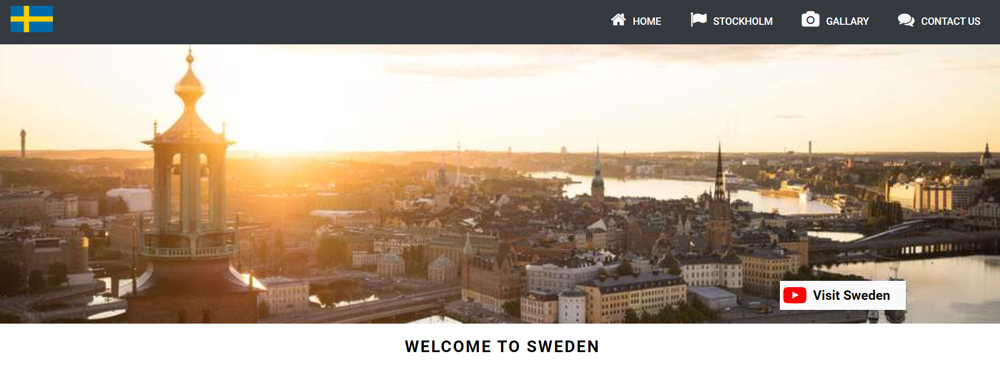

## Table of contents
* [General Information](#General-information)    
* [Website business goals](website-business-goals)                    
* [Scope](#scope)
* [User Experience](#user-experience)
* [Technologies](#technologies)
* [Features](#features)
* [Testing](#testing)
* [Deployment](#deployment)
* [Credits](#credits)

# General Information
<h1 align="center">Welcome To Sweden</h1>

This project deals with a simple presentation of one of the most important Scandinavian countries, which is the Kingdom of Sweden. The aim of this website is to attract tourists to this wonderful country, distinguished by its picturesque nature, refreshing climate, and ancient history, which deserves to be known closely. It reviewed one of the most important provinces in the state of Sweden, which is the heart of the country **The capital,Stockholm**
This project contains 4 basic pages, which are the **Home page** ... **Stockholm page**  ...**gallary page** ... and finally a **Contact page** which can contact with the developer to respond to any question or inquiry from the visitor about the country and It should be clear, easy to navigate, and responsive to different types of devices.

 
 

# Website business goals
## The primary goals of building a Website is:
-  Visit Sweden is promoting Sweden in order to attract more visitors from abroad to discover our wonderful country on behalf of the Swedish state.

- More visitors and longer visits means:
  - Work in the Swedish tourism industry,
  -  Economic growth f
  -  Increasing employment throughout Sweden.
  -  Education in various Swedish universities and integration through it with other cultures

# Scope
The second project is built on solid foundations, which makes the website more effective amd interactive  with the users, and this is the main goal of it ... the project consists of **HTML 5**, **Stylesheet CSS**, and **JavaScripts**.
ADD http://ami.responsivedesign.is/

 

# User Experience
 ##  First-time visitor goals
 1. Understand the content of the Website easily
 2. Navigate between the pages of the Website smoothly
 3. The desire to create a simple and sound website that works on different sizes of the devices, which makes the visitor visit the site from any device he owns or has within his reach
 4. The visitor’s interest in seeing an integrated and comprehensive site for all the information that may be important to him
 5. The visitor's desire to see a site that includes different pictures of the most important places in the country, which may attract the visitor's attention and increase his desire to visit this country and get to know the country closely
6. As a new visitor want to see a cool website with beautiful colors and clear, easy-to-understand reading fonts

## Frequent Visitor Goals

1. The site is concerned with the most beautiful tourist areas, which increases the visitor's desire to visit the site frequently.
2. An uncomplicated search method that makes it easy for the frequent visitor to reach his goal easily
3.  The site includes the most important tourist, cultural and historical points. Which makes the visitor or tourist want to visit Sweden
4. If you're longing for wild nature full of mountains, trees, lakes and animals, Sweden is one of the best places to experience it and one of the important Stockholm hiking spots has been shown at the site.
5. Castles, do you like castles? From Stockholm and below there are hundreds of castles to check out, it's possible to visit Drottningholm Palace where the Swedish King and Queen live and Some details of one of the royal castles have been placed at the Website.
6. Stockholm, the capital of Sweden, with all its canals, islands and small islands. Stockhome is a great capital, not too big, not too small, quite suitable. The rich history and culture offer a wonderful visit as well as the surrounding nature and a wide range of entertainment شnd on the Stockholm page there is some brief information that attracts the frequent visitor.
7. Architecture, Swedish architecture offers a mixture of the old and the new. Many cities have preserved the old style and you won't see much skyscrapers here. The details are exceptional, just look at some of the photos that have been added to the Website and although we do not have many skyscrapers, we do have quite a few unique buildings with wonderful architecture.¨
8. And many many other reasons that cannot be shortened here, which makes the visitor visit the Website again and again, and thus reach the goal of the project, which is to visit the country rich in nature, stunning beauty and beautiful history.

