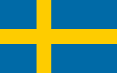
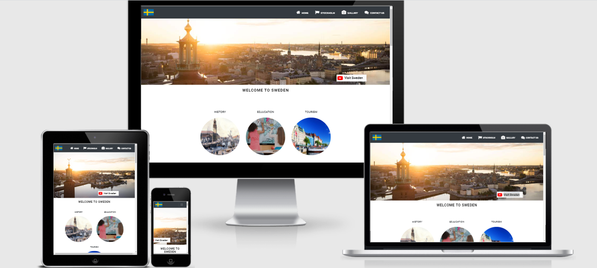

# General Information
<h1 align="center">Welcome To Sweden</h1>

This project deals with a simple presentation of one of the most important Scandinavian countries, which is the Kingdom of Sweden. The aim of this website is to attract tourists to this wonderful country, distinguished by its picturesque nature, refreshing climate, and ancient history, which deserves to be known closely. It reviewed one of the most important provinces in the state of Sweden, which is the heart of the country **The capital,Stockholm**
This project contains 4 basic pages, which are the **Home page** ... **Stockholm page**  ...**gallary page** ... and finally a **Contact page** which can contact with the developer to respond to any question or inquiry from the visitor about the country and It should be clear, easy to navigate, and responsive to different types of devices.

 
 

## Table of contents
* [General Information](#General-information)    
* [Website business goals](website-business-goals)                    
* [Scope](#scope)
* [User Experience](#user-experience)
* [Technologies](#technologies)
* [Features](#features)
* [Testing](#testing)
* [Deployment](#deployment)
* [Credits](#credits)

# Website business goals
## The primary goals of building a Website is:
-  Visit Sweden is promoting Sweden in order to attract more visitors from abroad to discover our wonderful country on behalf of the Swedish state.

- More visitors and longer visits means:
  - Work in the Swedish tourism industry,
  -  Economic growth 
  -  Increasing employment throughout Sweden.
  -  Education in various Swedish universities and integration through it with other cultures

# Scope
The second project is built on solid foundations, which makes the website more effective amd interactive  with the users, and this is the main goal of it ... the project consists of **HTML 5**, **Stylesheet CSS**, and **JavaScripts**.

 

# User Experience
## User stories
 ### First-time visitor goals
 1. Understand the content of the Website easily
 2. Navigate between the pages of the Website smoothly
 3. The desire to create a simple and sound website that works on different sizes of the devices, which makes the visitor visit the site from any device he owns or has within his reach
 4. The visitor’s interest in seeing an integrated and comprehensive site for all the information that may be important to him
 5. The visitor's desire to see a site that includes different pictures of the most important places in the country, which may attract the visitor's attention and increase his desire to visit this country and get to know the country closely
6. As a new visitor want to see a cool website with beautiful colors and clear, easy-to-understand reading fonts

### Frequent Visitor Goals

1. The site is concerned with the most beautiful tourist areas, which increases the visitor's desire to visit the site frequently.
2. An uncomplicated search method that makes it easy for the frequent visitor to reach his goal easily
3.  The site includes the most important tourist, cultural and historical points. Which makes the visitor or tourist want to visit Sweden
4. If you're longing for wild nature full of mountains, trees, lakes and animals, Sweden is one of the best places to experience it and one of the important Stockholm hiking spots has been shown at the site.
5. Castles, do you like castles? From Stockholm and below there are hundreds of castles to check out, it's possible to visit Drottningholm Palace where the Swedish King and Queen live and Some details of one of the royal castles have been placed at the Website.
6. Stockholm, the capital of Sweden, with all its canals, islands and small islands. Stockhome is a great capital, not too big, not too small, quite suitable. The rich history and culture offer a wonderful visit as well as the surrounding nature and a wide range of entertainment شnd on the Stockholm page there is some brief information that attracts the frequent visitor.
7. Architecture, Swedish architecture offers a mixture of the old and the new. Many cities have preserved the old style and you won't see much skyscrapers here. The details are exceptional, just look at some of the photos that have been added to the Website and although we do not have many skyscrapers, we do have quite a few unique buildings with wonderful architecture.¨
8. And many many other reasons that cannot be shortened here, which makes the visitor visit the Website again and again, and thus reach the goal of the project, which is to visit the country rich in nature, stunning beauty and beautiful history.

## Design
### Colour Scheme
- The main colors in the project are white, dark gray and black because they are colors that comfort to the eyes, which attracts the visitor in browsing the Website happily, as these colors were used in the navbar, but the yellow and blue colors were used in the foot and is inspired by the Swedish flag which consisting of these two colors as a gratitude and appreciation for this great country.
- Colour Palette: Since the site is tourist and has a lot of pictures, the comfortable basic colors were used in addition to the colors of the Swedish flag, which are:
   - #343a40 (dark gray color)
   - #046aa9 (blue color from swedish flag)
   - #fecd00 (yellow color from swedish flag)
   - #000 (black color)
   - #fafafa (milky color)
   - #fff (white color)

## Typography
- Roboto font is the main font used throughout the site with Sans Serif as the backup font In case the font is not imported properly to the site for any reason, this font that I used on the pages is a clean font that is used frequently in programming, so it is both attractive and appropriate.

- The source for the inspired font is [Google Fonts](https://fonts.google.com/)

## Imagery
- All images and logo have been obtained by Google Researcher.I have used large size images in the interface in the Stockholm, Gallery and home pages to clearly display the country and to catch the user's attention to my site.
- I used a slide show component to navigate the images using Bootstrap 4 and the idea was the developer's idea in the Stockholm page.

## Wireframes
-  All wireframes pages were created by [mockflow-wireframe](https://mockflow.com).I made a simple and concise layout of all pages in the project, which are  Home, Stockholm, Gallery, and Contact pages.

[View the Home-page wireframe](https://s3.amazonaws.com/assets.mockflow.com/app/wireframepro/fileexport/Export_De0b19fbea34a0b818ba9838bc87b1990.pdf)

[View the Stockholm-page wireframe](https://s3.amazonaws.com/assets.mockflow.com/app/wireframepro/fileexport/Export_Df06e5b5e0aae5a6ddcc4dc980ffb86df.pdf)

[View the Gallary-page wireframe](https://s3.amazonaws.com/assets.mockflow.com/app/wireframepro/fileexport/Export_D01efac908f659dcb6df42d2903699d27.pdf)

[View the Contact-page wireframe](https://s3.amazonaws.com/assets.mockflow.com/app/wireframepro/fileexport/Export_D30487c1078dbfad1f940e905ef756fc7.pdf)

- Here I have created mobile app layout for the most important pages in the project, which are Home, Stockholm, and Gallery.

[View the Mobile responsive wireframe](https://s3.amazonaws.com/assets.mockflow.com/app/wireframepro/fileexport/Export_D26a47b0cb10d6cbd8cafe3e14d21e001.pdf)

# Technologies
## Languages Used:
  - [HTML5](https://en.wikipedia.org/wiki/HTML5)
  - [CSS3](https://en.wikipedia.org/wiki/Cascading_Style_Sheets)
  - [JavaScript](https://en.wikipedia.org/wiki/JavaScript)

## Frameworks, Libraries & Programs Used:
- [Google Fonts](https://fonts.google.com/) :
Google fonts were used to import the “Roboto” font into the style.css file which are used on the website.
- [Font Awesome](https://fontawesome.com/v4.7.0/icons/) :
Used to add icons to the navbar header of the website.
- [jQuery](https://jquery.com/) :
jQuery used to 
  - Make the navigation bar responsive.
  - Add unorderd list and table in the home page.
  - And to add event listeners. 
- [EmailJS](https://www.emailjs.com/) :
Used to Get and Send emails from/to the users.
- [Hover.css](http://ianlunn.github.io/Hover/) :
Used to add effects to the jpg,png images.
- [Bootstrap 4](https://getbootstrap.com/) :
Used  as assist to help me make the Website more stylish and responsiveness.
- [Git](https://git-scm.com/) :
Git was used for version control by utilizing the Gitpod terminal to commit to Git and Push to GitHub.
- [GitPod](https://gitpod.io/) :
GitPod was used as an IDE to develop a project. A project was built on a gitpod template of the Code institute.
- [GitHub](https://github.com/) :
GitHub is used to store the projects code after being pushed from Git.
- [PhotoPad Photo Editing Software](https://www.nchsoftware.com/photoeditor/index.html) :
Used to resize images and editing photos for the website.
- [Mockflow wireframe](https://www.mockflow.com/) :
Used to create the wireframe pages.
- [Google map](https://developers.google.com/maps/gmp-get-started):
I used google map to creat my map with clusters and markers and have been added most importent touristpoints in the map.
- [Paint](https://www.getpaint.net/):
I have used Paint image and photo editing software to crob and resize the Pr scr images.

# Features
## The Website is summarized to:
- The site consists of 4 pages: [Home](https://farah1979.github.io/welcome-to-sweden/index.html), [Stockholm](https://farah1979.github.io/welcome-to-sweden/stockholm.html), [Gallery](https://farah1979.github.io/welcome-to-sweden/gallary.html) and [Contact Us](https://farah1979.github.io/welcome-to-sweden/contact.html)
- Each page contains a large eye-pleasing image that shows the user one of the country's most picturesque landmarks
- The page navigation slide is easy and clear to the user, as it makes the user move between pages comfortably
- While scrolling on the page, the navigation slide is downloaded with the user, making it easy for the user to move to the next page without returning to the top of the page.

## Home page : 
### This page consists of Header, five sections and footer
1. Header:
The main page consists of a navigation bar, as it includes the swedish flag on the right side, and on the left side there is a menu of the four pages , as this converter into a hamburger menu on devices with small screens.

2. First section: Is a large image of the city of Sweden, and we have added some graphic effects that attract the visitor, and within the image we put the Youtube Logo, which is a link that includes a movie, where by clicking on the link, the visitor will move to a page outside the site, which can be viewed and enjoyed, and the visitor is presented with details More about the country.

3. Second section: Includes pictures and each picture is directed to its own section, and these three sections are about the history of Sweden ... education in Sweden ... and tourism in the country.

4. Third section; Includes information about the history of the country and some pictures that express the originality of the country in the past. The *Roboto* fonts  was used as a basic with black  color to facilitate reading for the reader.

5. Fourth section: Includes information about education in the country with a simple and beautiful picture. In addition, a unorderd list and table were built in JavaScript.

6. Fifth section: Contains information about the country's tourism with three buttons, where the user can press on the button and he will go through it to the gallery page smoothly.

7. Footer: Finally, it includes the footer and in the footer there is on the right side the country logo, where a link has been placed through this link the user can move directly and smoothly to the top of the same page and in the middle includes links to different pages outside the site with these liks is possible for the user to learn more and gather as much information as possible about The country and on the left side are links to social media links like Facebook, Instagram, Twitter, Linkedin, and Youtube for Sweden.

## Stockholm page : 
### This page consists of Header, five sections and footer

1. As for the navigation bar, the footer is the same as it is on the Home page and the rest of the other pages.

2. First section: Is a large and beautiful image interface that refers to the capital, Sweden, which is Stockholm, and a simple animation has been added by the stylesheet CSS.

3. Second section is the welcome section for the visitor to visit Stockholm. Two flags were placed as a symbol of the country, and used the colors blue and yellow inspired by the flag of Sweden, in addition to some simple brief information about the capital and its history. Pictures are placed where the user can scroll through these images manually, and there are five slides in the carousel. Each slide includes a title and short text around each image and were built with Bootstrap 4.

4. The third section consists of simple pictures with a short text for each image in addition to some tips and suggestions for visitors wishing to find suitable places for walking and enjoying the picturesque nature and wonderful atmosphere with two pictures belonging to these places.

5. Fourth section was designed with two cards indicating the most popular walking places in Stockholm and in each card a directionslink was placed that points directly to a Google map with more comprehensive data for each place outside the site and have been added a link*See me on the map* which brings him to a map I designed it as a programmer and will show him a particular marker with more information about both sites that you have indicated in both cards.
In the bellow of these cars there is a map that includes the most important tourist points that the visitor can use this map as a tourist guide when visiting the country and on the Google Map have been added clusters and markers for easy access to tourist points locations. Every place has its own marker on the map and by clicking on the marker, Inform window with a short text appears.

6. Fifth section consists of 6 pictures indicating the most important activities that can be practiced when visiting the country, and in each picture there is an information bar for each activity.

## Gallary page : 
### This page consists of Header, one section with four buttons and footer

1. As for the navigation bar, the footer is the same as it is on the Home page and the rest of the other pages.

2. Four buttons are created on this page and they are: 
- First button, and we might consider it as main section, it is a presentation of all the activities, restaurants and important events that take place in the capital, Stockholm. They have been designed as cards in each card that includes a picture of a place, activity, restaurant or café that is famous in the country and in each card has been added A name and a short text referring to it.

- The second button, when the visitor presses it, will show him only data on places that can be visited in the country and activities that can be practiced.

- The third button, when pressed, will display the most important restaurants and cafes that you can visit and enjoy the most delicious food and drinks in the country.

- The fourth and last button displays for the visitor the most important events and occasions that take place in the country, and the dates of each event have been set.

## Contact Us page: 
### This page consists of Header, one section and a footer

1. As for the navigation bar, the footer is the same as it is on the Home page and the rest of the other pages.

2. On the front of the page, a large image has been placed that includes simple text indicating that it is the contact page with the programmer.

3. This page was created to allow the visitor or user to communicate with the programmer to answer any question or inquiry that the visitor wishes to ask about the country or any place he wishes to obtain more comprehensive and accurate information, by filling out a form. The form includes the first and last name, username, and email and through the user´s Email can the programmer communicates with the questioner as well as with the text area. There the user can write anything he would like to write to the programmer, and then click on the send us button. This page is an interactive  page, and have been used a Emailjs.

# Testing
The W3C Markup Validator, W3C CSS Validator and Beautify Tools JavaScript Validator Services were used to validate every page of the project to ensure there were no syntax errors in the project.
- [W3C Markup Validator](https://validator.w3.org/#validate_by_input)
- [W3C CSS Validator](https://jigsaw.w3.org/css-validator/#validate_by_input)
- [Beautify Tools JavaScript Validator](https://beautifytools.com/javascript-validator.php)

## Manual testing for each page and make sure that evrything is working corect
### Home page:
 - Navbar:
   - Click on the swedish flag in right side of the navbar to make sure that it links to the homepage.

   - Look and click on the navbar items and make sure each works correctly and opens the correct page for it.
- Check that the header will move down when the user scrolls down the homepage or any other page in the project.
   - Change the screen size from the desktop to the tablet or to the mobile phone, then you will notice that the built-in navigation menu will turn into a mobile hamburger menu and then make sure that all the menu items are working properly and in the correct place.

  - Click on the YouTube icon from the big picture, where a new window will open outside the site and a documentary film about Sweden will be displayed.

  - Below the phrase welcome to Sweden, you will see 3 circular images as each image is a guide to its section..Click on each image and make sure it will take you to the right place.

  - In the middle of the page in the Education section on the left side, you will find a list titled * Useful Links in Sweden *, which consists of fields that each field contains a link to its site for those who wish to know the laws of the country or for those who wish to educate. Click each link, and it will open a new window for you on its website, giving you more information about the country.

  - At the end of the page before the footer there are 3 buttons, click on them, you will find that they work smoothly and they will take you to the gallery page.

  - Hover over the button to verify that it changes its colour.

 - Expand and reduce a screen size to verify that all sections with the text and images looks good on different screen widths.
 - Make sure that all contents in this page are visible.
 

  - Footer.
    - In the footer you will find the country logo, click on it, and it will take you to the top of the same page easily.
    - Additionally, 3 links have been developed,Click any one of them. You will find a new website that will open outside of the programmer's site to attract as much information about visiting that country as well.
    - Click on the social media links, you will notice that they are working properly and a new window will open for you with their social media link.
    - Change the window width to verify that the footer is responsive and looks good for different screen sizes.

### Stockholm page:
 - Make sure that all contents in this page are visible.
 -  Expand and reduce a screen size to verify that all sections with the text and images looks good on different screen widths.
 - Change the images on the carousel item by clicking on the "Next or Previous" button, and you will find that they work fine.
 - There are 3 images under the phrase "DISCOVER OUR CAPITAL IN NEW, CREATIVE WAYS!" Mouse over it, you will find simple animation effects in every image to increase the aesthetics of the site.
 - On this page, one of the most important places for hiking in the capital “Skinnarviksberget” and “Skogskyrkogården” is presented,
   - Click on the first link, where you will find it below the picture, you will notice that the place’s site will open in the new tap to read more about this place and get to know it.
    - Click on the second link at the end of the card to make sure that the correct map marker will be zoomed in.
  - Google map:
    - Check that the clusters are working properly.
    - Make sure all markers are on the map.
    - Click on each marker to open this infowindow.
    - Check that the infoWindow contains comprehensive data for every place that was added to the map. 
    - Make sure that all information about the place is correct.
    -  In addition, make sure that each link appears with you in the infowindow works correctly.

### Gallary page:
- Make sure all contents in this page are visible.
- Expand and reduce a screen size to verify that all sections with the text and images looks good on different screen widths.
- Hover your mouse over each of the four buttons at the top of the page, and you will find that the opacity of the image will decrease.
- You will find one of the four buttons in a different color than the others, which indicates that it is active.
- Click on the show all button, you will find all the images with their text shown on the page.
- Click on the second, third, or fourth button. Only images with their own data will appear.
- Click the button to make sure that it links with the correct section.
- Check that all buttons are working properly.

### Contact page:
- Ensure that this form cannot be submitted without filling in all the required fields.
- Ensure that the user has successfully sent their message to the programmer's email by testing the form.
- Ensure that all fields will be cleaned automatically after the user sends messages.
- Make sure all contents in this page are visible.
- Expand and reduce a screen size to verify that all section looks good on different screen widths.

## Testing User Stories from the User Experience section
### First Time Visitor Goals
- Understand the content of the website smoothly and without complication
- When the visitor enters the site for the first time, he will see the country’s flag in the scroll bar(Navbar) on one side and on the other side the items of the navbar through which he will be able to navigate to any page he wants easily.
- The website contains a clear, understandable, responsive and movable navigation bar, which allows the user to easily move between pages, and the addition of the animated bar feature allows the visitor the greatest amount of ease to change betwwen different pages.
- As a new user, I would like to see a website working properly on my device.
- I want a website that can be responsive on the different devices and 
 different screen widthes.
 - I want a site that has clear content, beautiful images and comfortable writing fonts.
- I want all location data to be clear and understandable on devices of various sizes and work with various browsers as well.
- I want a site with all the important information about the country to facilitate my destination and the possibility of not taking a great deal of time from the visitor searching to get what he needs about the country.
- I want to find a map on the site that I as a tourist in this country, can use it as a guide and guide for my way and it must be clear and easy to use.
- As a first time visitor, I want to find some tips and advice on the most important places in the country.
- On the website page, the visitor can click on any marker available on the map, and full information about this tourist point will appear in the infowindow, whether it is the best hotels, restaurants, cafes or entertainment places.
- All buttons, form and links have been tested several times and worked perfectly.
- The Facebook, Instagram, Linkedin, Twitter Pages can be found at the footer of every page and every one will open a new tab for the user and more information can be found on the Social pages.
- The Youtube link can be found in two diffrent place in the big image in the Home page which can easily click on it and see more information about the country and in the footer of every page and will open a new tab for the user and can find many videos about the country.

### Frequent visitors Goals
- As a frequent visitor, I want to check if there are any updates or newly added information.
- As a frequent user, it will be easy for me to plan a tourist or educational trip to this wonderful country.
- As a frequent visitor, I want to ask all possible questions about the trip to the programmer before I travel
- I want to make sure that the site works easily in all devices and that there are no apparent problems.

### Further testing
- The site was tested on various browsers, such as Google Chrome, Mozilla Firefox, Microsoft Edge and
Safari.
- To ensure that the website is responsive and work corect it is shown on different devices such as desktops, laptops, tablets (Samsung galaxy tab A), and mobile (Iphone 6, IPhone X, IPhone XS Max, IPhone11 PRO MAX, and Samsung Galaxy S10).
- A large amount of testing was done to ensure that all pages were linking correctly.
- All buttons, form and links have been tested multiple times to ensure they are working properly.
-  Friends and family members were asked to review the site and documentation to point out any bugs and/or user experience issues.

### Known Bugs
- No known bugs.

# Deployment
## GitHub Pages
### My project was deployed to GitHub Pages using the following steps:
1. Log in to GitHub and locate the GitHub Repository
2. At the top of the Repository (not top of page), locate the "Settings" Button on the menu.
3. Scroll down the Settings page until you locate the "GitHub Pages" Section.
4. Under "Source", click the dropdown called "None" and select "Master Branch".
5. The page will automatically refresh.
6. Scroll back down through the page to locate the now published site link in the "GitHub Pages" section.
7. This is my publish website link [Welcome To Sweden](https://farah1979.github.io/welcome-to-sweden/)

# Credits
## Code
[Bootstrap 4](https://getbootstrap.com/docs/4.4/getting-started/introduction/)
- Bootstrap Grid: used to easy and smoothy build the main stractures of my project.
- Bootstrap components: I have used many components to create a navigation bar, carousel items, card items and to make the Website more smoothly and responsive.

[W3schools](https://www.w3schools.com/), [Stack overflow](https://stackoverflow.com/): These resources were used to find coding hints and solutions.

[Code Institute Lectures](https://codeinstitute.net/): I was referring to some of the lectures during the construction of the project to remind some data that I had forgotten.

[Mockplus](https://www.mockplus.com/blog/post/hamburger-menu-examples): From this site, I learned how to build a hamburger menu in various mobile devices.

## Content
- All code has been written by developer.
- The data was copied from various Swedish sites, and all links on the site refer to external sites for the benefit and the future of this country and the idea of the big images was inspired by them like [Visitsweden](https://visitsweden.com/).

## Media
- Images were used from the following sites:
  - [Unsplash](https://unsplash.com/s/photos/stockholm)
  - [Google](https://www.google.com/search?q=+images+for+sweden&tbm=isch&ved=2ahUKEwiN2q2NtpTwAhXHtioKHfcFBhkQ2-cCegQIABAA&oq=+images+for+sweden&gs_lcp=CgNpbWcQA1CepgFYw6sBYNmzAWgAcAB4AIABVogBiQSSAQE3mAEAoAEBqgELZ3dzLXdpei1pbWfAAQE&sclient=img&ei=8sSCYI2ZF8ftqgH3i5jIAQ&bih=657&biw=1396&rlz=1C1SQJL_svSE836SE836)

  ## Acknowledgements
 - I have had great support from my family, first and foremost my husband, as well as my best friend
 - My Mentor Akshat_Garg for support and useful feedback.

